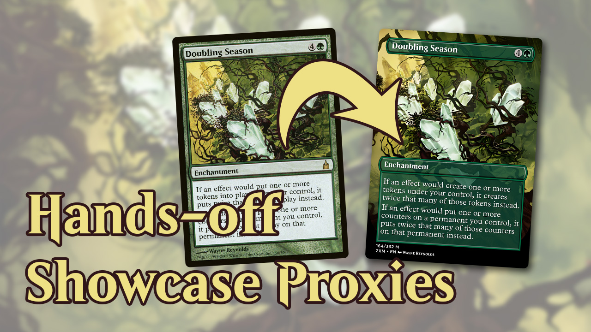
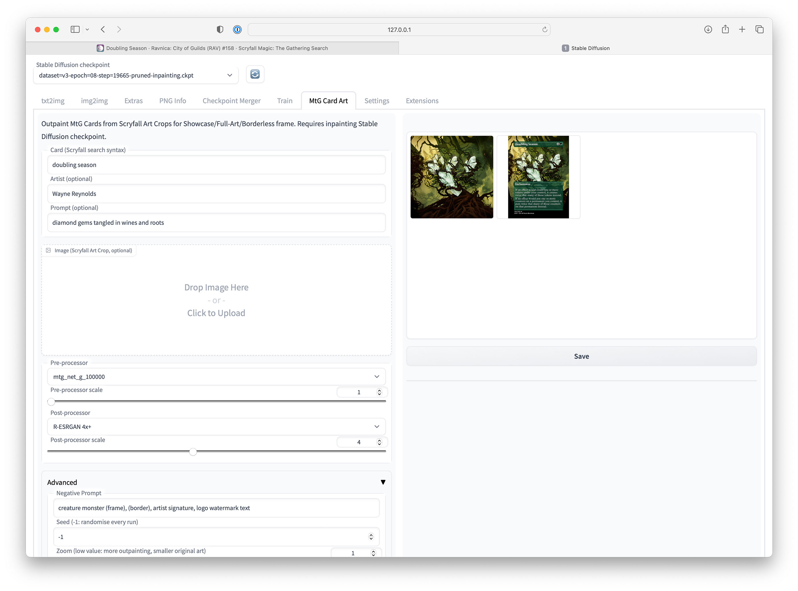

# Stable Diffusion WebUI MtG Card Art Extension

> One-click MtG Full-art proxy creation.

* https://huggingface.co/rullaf/magic-diffusion
* https://huggingface.co/rullaf/RealESRGAN_MtG

## Demo

https://youtu.be/DF0ITZhnje4

<a href="https://youtu.be/DF0ITZhnje4"></a>



## Installation

1. Clone https://github.com/AUTOMATIC1111/stable-diffusion-webui *at version `beeec2b59833abe7ab6f90bdf99c65796a10bca0`*, different versions are not supported (and are known to be incompatible)
   1. After cloning, do `git checkout beeec2b59833abe7ab6f90bdf99c65796a10bca0`
   2. Follow https://github.com/AUTOMATIC1111/stable-diffusion-webui#installation-and-running
   3. Only after you checked out the correct version, install all dependencies etc
2. Download Magic Diffusion v3 inpainting model from [huggingface.co/rullaf/magic-diffusion](https://huggingface.co/rullaf/magic-diffusion/blob/main/dataset%3Dv3-epoch%3D08-step%3D19665-pruned.ckpt) and place it under `models/Stable-diffusion/` directory in webui root. 
3. Download RealESRGAN MtG upscaling model from [huggingface.co/rullaf/RealESRGAN_MtG](https://huggingface.co/rullaf/RealESRGAN_MtG/blob/main/RealESRGAN_x2plus_mtg_v1.pth) and place it under `models/RealESRGAN/` directory in webui root.
4. Clone/download this extension into `extensions/mtg_card_art` in webui root.
5. Start the webui with `./webui.sh` (or an alternative for your platform)

## Usage

1. When correctly installed, you should see **MtG Card Art** tab. Switch to it.
2. Select the previously downloaded inpainting model as your Stable Diffusion checkpoint (top left corner dropdown).
3. Enter any card name (accepts scryfall syntax, such as `doubling season set:rav`)
4. If card has multiple arts, optionally enter an artist
5. For best results, include a prompt. The model understands MtG keywords, characters, and terminology.
6. You don't have to supply an image. Scryfall art crop is downloaded automtically.
7. Click Run, and wait for results to show up. The progressbar is known broken, and you will not see anything when post-processing upscaler is running. The progress should be visible in your terminal window.
8. When finished, select the outpainted image in gallery, click Save, and Download it.

## (Optional) Proxyshop integration

This integration is not ready to use out of the box, and requires macOS.

The code also has a hardcoded `proxyshop_enabled` feature gate. Put `render_target_files.jsx` from this repo and place it in your `MTG-Autoproxy` / Proxyshop checkout. 

On macOS, you can automate Photoshop Scripts with AppleScript

```osascript
on run argv
	tell application "Adobe Photoshop 2022"
		activate
		do javascript of file "/YOUR_PATH/MTG-Autoproxy-master/render_target_files.jsx" with arguments argv
	end tell
end run
```

which you can then invokes as

```bash
# osascript render-target.scpt "/tmp/Doubling Season (Wayne Reynolds).png" "/tmp/Doubling Season (Wayne Reynolds) - Showcase.jpg"
osascript render-target.scpt "$INPUT" "$OUTPUT"
```

You will also need to fine-tune `proxyshop.py` to match your setup.
